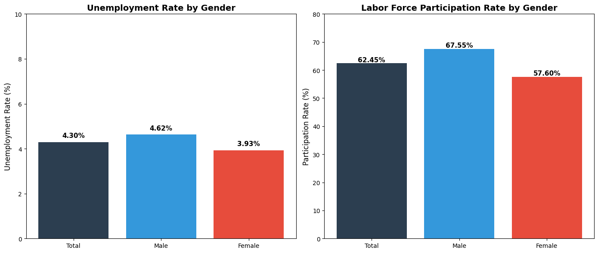
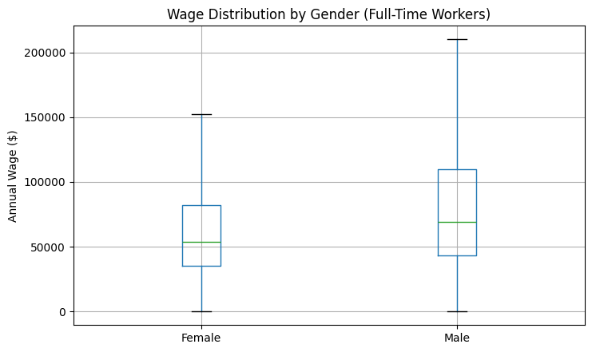
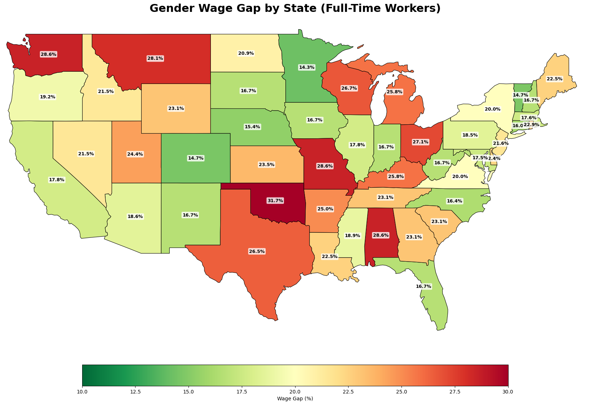
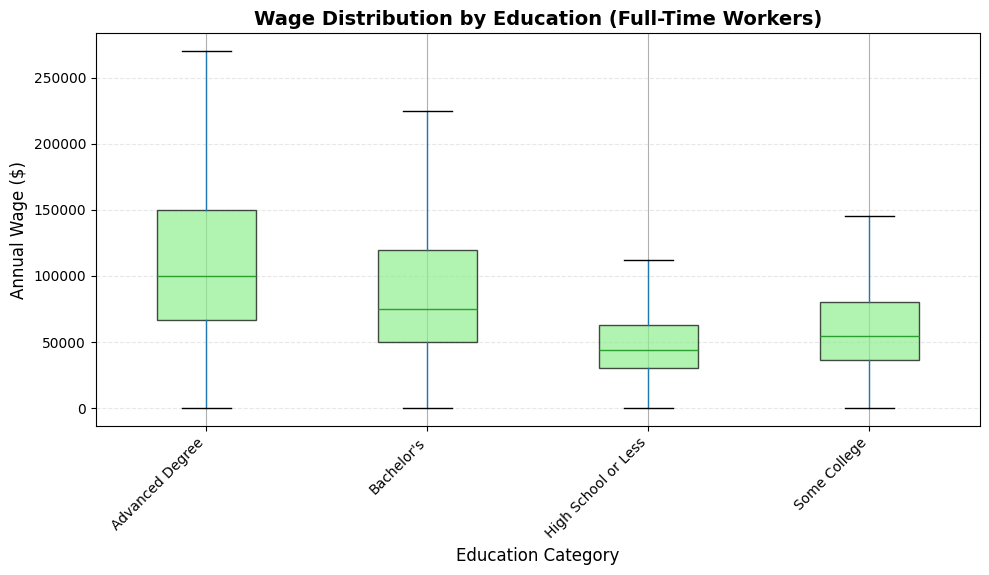
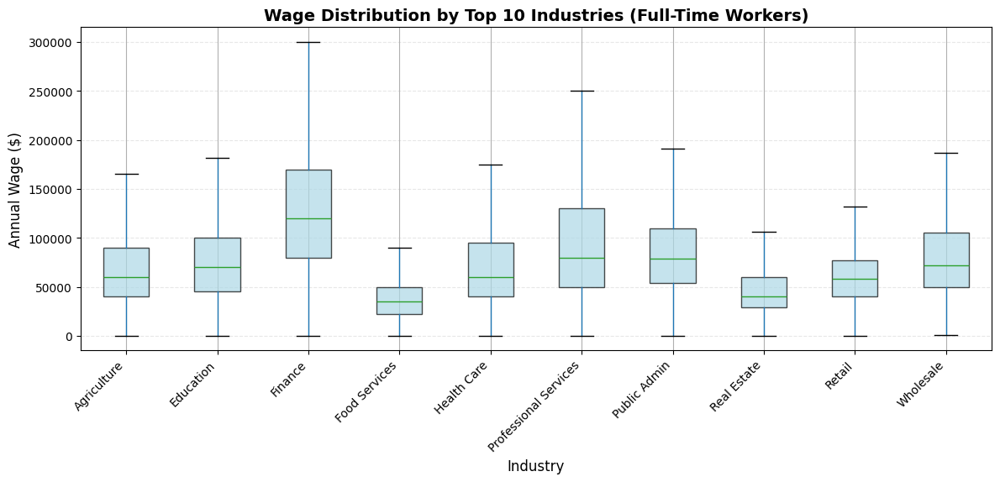
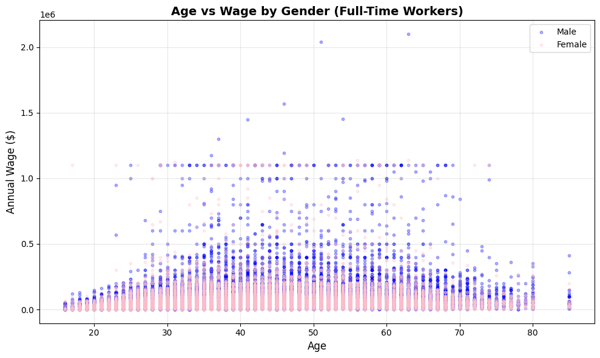
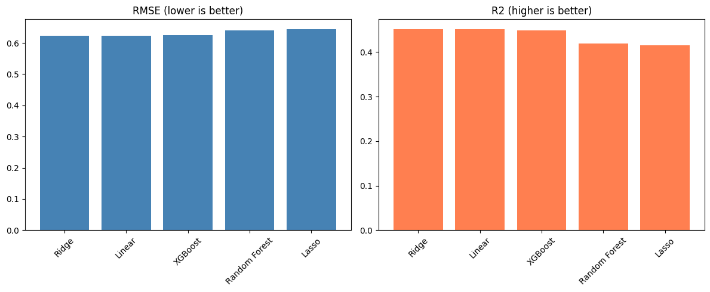
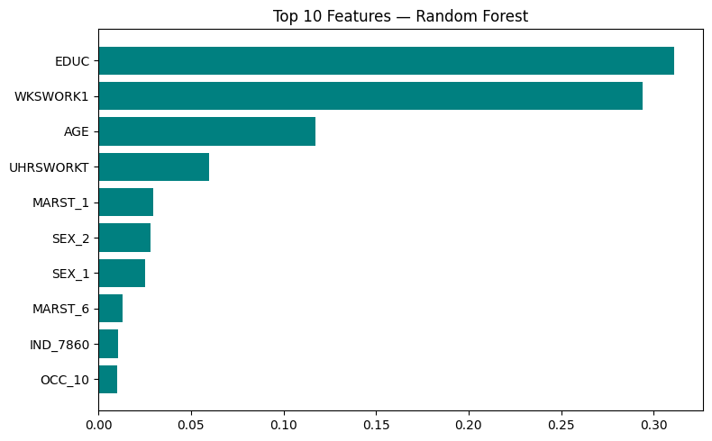

# Wage and Labor Market Analysis — CPS ASEC 2025

A data science project analyzing wage determinants, the gender wage gap, and labor
market participation using the U.S. **Current Population Survey (CPS), Annual Social
and Economic Supplement (ASEC), 2025**, sourced via [IPUMS-CPS](https://cps.ipums.org/cps/).

The project is organized as two self-contained notebooks:

- `Data_Cleaning_EDA_Analysis.ipynb` — data cleaning, exploratory analysis, and statistical analysis
- `Machine_Learning.ipynb` — wage-prediction models and evaluation

## Project Overview

The analysis answers three questions using real, individual-level survey microdata:

1. What do the **labor force participation rate** and **unemployment rate** look like,
   overall and by gender?
2. How large is the **gender wage gap**, and how much of it remains after controlling
   for education, hours worked, occupation, industry, and other observable factors?
   How does it vary across states?
3. Can we **predict individual wages** from demographic and job characteristics, and
   which modeling approach works best?

## Dataset Description

- **Source:** IPUMS-CPS, ASEC 2025 extract.
- **Unit of observation:** individual person-records from CPS households.
- **Cleaned sample size:** 111,796 records, restricted to the working-age (16+),
  ASEC-eligible civilian population.
- **Key variables:** `AGE`, `SEX`, `RACE`, `MARST` (marital status), `EMPSTAT`
  (employment status), `OCC` (occupation), `IND` (industry), `CLASSWKR` (class of
  worker), `UHRSWORKT` (usual hours worked), `EDUC` (educational attainment),
  `WKSWORK1` (weeks worked last year), `INCWAGE` (annual wage and salary income),
  and `ASECWT`/`ASECWTH` (the ASEC person/household weights used to make the
  sample representative of the U.S. population).

## Methodology

### 1. Data Cleaning
- Restrict to respondents aged 16+, drop Armed Forces and "Not In Universe"
  employment-status records, keep only ASEC supplement records.
- Derive labor-force status flags (`LABOR_FORCE`, `EMPLOYED`, `UNEMPLOYED`, `NILF`)
  from `EMPSTAT`.
- Derive readable category labels for sex, marital status, education, and class of worker.
- Add a log-transformed wage variable (`LOG_INCWAGE`).

### 2. Statistical Analysis
- All population-level statistics use the CPS `ASECWT` survey weight.
- The gender wage gap is computed with the mean, median, and weighted median, for
  both all positive-wage workers and a full-time-only subsample (35+ usual
  hours/week, the BLS definition of full-time work).
- A state-level breakdown compares median male and female wages by `STATEFIP`.
- A weighted least-squares (WLS) regression of `log(INCWAGE)` on age, education,
  hours worked, weeks worked, occupation, industry, class of worker, marital
  status, and state estimates the **controlled** gender wage gap.

### 3. Machine Learning
- **Target:** `log(INCWAGE)` for full-time, positive-wage workers.
- **Features:** age, sex, education, usual hours worked, weeks worked, marital
  status, class of worker, occupation, industry, and state (852 features after
  one-hot encoding).
- **Models compared:** Linear Regression, Ridge, Lasso, Random Forest, XGBoost —
  all trained with CPS survey weights and evaluated with an 80/20 train/test split.

## Key Findings

### Labor Market Statistics (weighted, 16+ population)

| Metric | Overall | Male | Female |
|---|---|---|---|
| Labor force participation rate | 62.5% | 67.6% | 57.6% |
| Unemployment rate | 4.3% | 4.6% | 3.9% |

Women have a 9.9-percentage-point lower labor force participation rate than men,
but a slightly lower unemployment rate (a 0.7-point gap) among those actively in
the labor force.



### Gender Wage Gap

| Comparison | Mean-based gap | Median-based gap | Weighted-median gap |
|---|---|---|---|
| All positive-wage workers | 29.0% | 25.0% | 25.0% |
| Full-time workers only (BLS definition) | 24.2% | 21.7% | 18.8% |



After controlling for age, education, hours worked, weeks worked, occupation,
industry, class of worker, marital status, and state in a weighted regression
(R² = 0.474), the estimated gap between women's and men's predicted wages is
**−15.5%** — smaller than the raw full-time gap, but still substantial, meaning
sex remains associated with a meaningful wage difference even among workers with
similar observable characteristics.

The gap also varies widely by state: it is largest in Oklahoma (31.7%), and
similarly high (~28–29%) in Missouri, Alabama, and Washington, while it is
smallest in Alaska and Hawaii (~13%) and Minnesota (14.3%).



### Wages by Education (full-time workers, vs. High School or Less)

| Education | Weighted median wage | Premium |
|---|---|---|
| High School or Less | $43,000 | — |
| Some College | $54,000 | +26% |
| Bachelor's | $75,000 | +74% |
| Advanced Degree | $100,000 | +133% |



### Wages by Industry (top 10 by frequency, full-time workers)

Finance had the highest median wage ($120,000), followed by Professional
Services ($79,950) and Public Administration ($78,370); Food Services had the
lowest ($35,000) among the top 10 industries by sample size. 



### Age vs. Wage, by Gender



### Machine Learning Model Comparison

| Model | RMSE (log-wage) | R² |
|---|---|---|
| **Ridge Regression** | **0.6234** | **0.4512** |
| Linear Regression | 0.6234 | 0.4512 |
| XGBoost | 0.6245 | 0.4493 |
| Random Forest | 0.6410 | 0.4198 |
| Lasso Regression | 0.6435 | 0.4152 |

Ridge and Linear Regression perform essentially identically and edge out the
other models, with XGBoost close behind. Lasso selects 101 of 852 encoded
features with only a small drop in R². Across models, **education, weeks
worked, and age** consistently rank among the strongest wage predictors.




## Technologies Used

- **Python** (pandas, NumPy)
- **Visualization:** Matplotlib, Seaborn, GeoPandas (state-level choropleth map)
- **Statistics:** statsmodels (weighted least squares)
- **Machine learning:** scikit-learn (Linear, Ridge, Lasso, Random Forest), XGBoost
- **Environment:** Jupyter Notebook (developed on Google Colab)

## Project Structure

```
.
├── README.md
├── requirements.txt
├── notebooks/
│   ├── 01_Data_Cleaning_EDA_Analysis.ipynb
│   └── 02_Machine_Learning.ipynb
└── images/
    ├── demographics.png
    ├── wage_gap_gender_fulltime.png
    ├── wage_by_education.png
    ├── wage_by_industry.png
    ├── age_vs_wage_scatter.png
    ├── wage_gap_by_state_map.png
    ├── labor_market_by_gender.png
    ├── model_comparison.png
    └── rf_feature_importance.png
```

## Installation and Usage

1. Clone the repository:
   ```bash
   git clone https://github.com/RezaTaran2005/Wage-Labour-Market-Analysis.git
   cd Wage-Labour-Market-Analysis
   ```

2. Install dependencies:
   ```bash
   python -m venv venv
   source venv/bin/activate   # On Windows: venv\Scripts\activate
   pip install -r requirements.txt
   ```

3. Update the data paths at the top of each notebook to point to your local
   copy of the CPS extract (the original notebooks were developed on Google
   Colab with data stored in Google Drive), then run:
   - `notebooks/01_Data_Cleaning_EDA_Analysis.ipynb` first — cleans the raw
     data, runs the EDA and statistical analysis, and saves the cleaned CSV.
   - `notebooks/02_Machine_Learning.ipynb` next — loads the cleaned data and
     trains/compares the wage-prediction models.

## Data Source and Citation

Data provided by IPUMS-CPS, University of Minnesota:
Sarah Flood, Miriam King, Renae Rodgers, Steven Ruggles, J. Robert Warren, Daniel
Backman, Annie Chen, Grace Cooper, Stephanie Richards, Megan Schouweiler, and
Michael Westberry. *IPUMS CPS: Version 12.0* [dataset]. Minneapolis, MN: IPUMS,
2024. https://doi.org/10.18128/D030.V12.0
